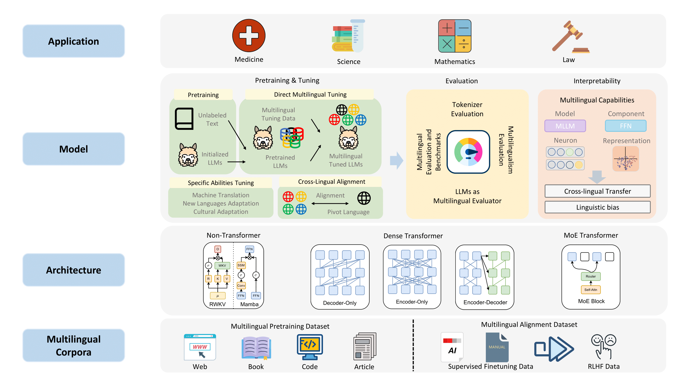

# Awesome-Multilingual-LLMs-Papers

This repository contains list of papers according to [our survey](https://arxiv.org/pdf/2310.19736.pdf):

<strong>Multilingual Large Language Models: A Systematic Survey</strong>

Shaolin Zhu1,   Supryadi1,   Shaoyang Xu1,   Haoran Sun1,   Leiyu Pan1,   Menglong Cui1, 

Jiangcun Du1,   Renren Jin1,   António Branco2†,   Deyi Xiong1†*

1TJUNLP Lab, College of Intelligence and Computing, Tianjin University

2NLX, Department of Informatics, University of Lisbon

(*: Corresponding author, †: Advisory role)

    

## Papers

### Multilingual Corpora

#### Pretraining Datasets

1. **"CulturaX: A Cleaned, Enormous, and Multilingual Dataset for Large Language Models in 167 Languages"**. 
   
    *Thuat Nguyen et al.* LREC-COLING 2024. [[Paper](https://aclanthology.org/2024.lrec-main.377/)]

2. **"RedPajama: an Open Dataset for Training Large Language Models"**. 
   
    *Maurice Weber et al.* arXiv 2024. [[Paper](https://arxiv.org/abs/2411.12372)] [[GitHub](https://github.com/togethercomputer/RedPajama-Data)] 

3. **"The BigScience ROOTS Corpus: A 1.6TB Composite Multilingual Dataset"**. 
   
    *Hugo Laurençon et al.* NeurIPS 2022. [[Paper](https://papers.nips.cc/paper_files/paper/2022/hash/ce9e92e3de2372a4b93353eb7f3dc0bd-Abstract-Datasets_and_Benchmarks.html)] [[GitHub](https://github.com/bigscience-workshop/data-preparation)] 

4. **"Zyda: A 1.3T Dataset for Open Language Modeling"**. 
   
    *Yury Tokpanov et al.* arXiv 2024. [[Paper](https://arxiv.org/abs/2406.01981)] [[GitHub](https://github.com/Zyphra/Zyda_processing)] 

#### SFT Datasets

1. **"Aya Dataset: An Open-Access Collection for Multilingual Instruction Tuning"**. 
   
    *Shivalika Singh et al.* ACL 2024. [[Paper](https://aclanthology.org/2024.acl-long.620/)]

2. **"Bactrian-X: Multilingual Replicable Instruction-Following Models with Low-Rank Adaptation"**. 
   
    *Haonan Li et al.* arXiv 2023. [[Paper](https://arxiv.org/abs/2305.15011)] [[GitHub](https://github.com/mbzuai-nlp/Bactrian-X)] 

3. **"CAMEL: Communicative Agents for "Mind" Exploration of Large Language Model Society"**. 
   
    *Guohao Li et al.* NeurIPS 2023. [[Paper](https://papers.nips.cc/paper_files/paper/2023/hash/a3621ee907def47c1b952ade25c67698-Abstract-Conference.html)] [[GitHub](https://github.com/camel-ai/camel)] 

4. **"OpenAssistant Conversations - Democratizing Large Language Model Alignment"**. 
   
    *Andreas Köpf et al.* NeurIPS 2023. [[Paper](https://papers.nips.cc/paper_files/paper/2023/hash/949f0f8f32267d297c2d4e3ee10a2e7e-Abstract-Datasets_and_Benchmarks.html)] [[GitHub](https://github.com/LAION-AI/Open-Assistant)] 

5. **"Phoenix: Democratizing ChatGPT across Languages"**. 
   
    *Zhihong Chen et al.* arXiv 2023. [[Paper](https://arxiv.org/abs/2304.10453)] [[GitHub](https://github.com/FreedomIntelligence/LLMZoo)] 

6. **"Crosslingual Generalization through Multitask Finetuning"**. 
   
    *Niklas Muennighoff et al.* ACL 2023. [[Paper](https://aclanthology.org/2023.acl-long.891/)] [[GitHub](https://github.com/bigscience-workshop/xmtf)] 

#### RLHF Datasets

1. **"Judging LLM-as-a-Judge with MT-Bench and Chatbot Arena"**. 
   
    *Lianmin Zheng et al.* NeurIPS 2023. [[Paper](https://arxiv.org/abs/2306.05685)] [[GitHub](https://github.com/lm-sys/FastChat/tree/main/fastchat/llm_judge)] 

2. **"OpenAssistant Conversations - Democratizing Large Language Model Alignment"**. 
   
    *Andreas Köpf et al.* NeurIPS 2023. [[Paper](https://papers.nips.cc/paper_files/paper/2023/hash/949f0f8f32267d297c2d4e3ee10a2e7e-Abstract-Datasets_and_Benchmarks.html)] [[GitHub](https://github.com/LAION-AI/Open-Assistant)] 

### Multilingual Tuning

#### Basic Tuning Strategies

##### Instruction Tuning

1. **"Finetuned Language Models Are Zero-Shot Learners"**. 
   
    *Jason Wei et al.* ICLR 2022. [[Paper](https://arxiv.org/abs/2109.01652)] [[GitHub](https://github.com/google-research/flan)] 

2. **"Multitask Prompted Training Enables Zero-Shot Task Generalization"**. 
   
    *Victor Sanh et al.* ICLR 2022. [[Paper](https://arxiv.org/abs/2110.08207)] [[GitHub](https://github.com/bigscience-workshop/t-zero)] 

3. **"Training language models to follow instructions with human feedback"**. 
   
    *Long Ouyang et al.* NeurIPS 2022. [[Paper](https://arxiv.org/abs/2203.02155)] [[GitHub](https://github.com/openai/following-instructions-human-feedback)] 

4. **"Training a Helpful and Harmless Assistant with Reinforcement Learning from Human Feedback"**. 
   
    *Yuntao Bai et al.* arXiv 2022. [[Paper](https://arxiv.org/abs/2204.05862)]

5. **"A General Language Assistant as a Laboratory for Alignment"**. 
   
    *Amanda Askell et al.* arXiv 2021. [[Paper](https://arxiv.org/abs/2112.00861)]

6. **"Self-Instruct: Aligning Language Models with Self-Generated Instructions"**. 
   
    *Yizhong Wang et al.* ACL 2023. [[Paper](https://arxiv.org/abs/2212.10560)] [[GitHub](https://github.com/yizhongw/self-instruct)] 

7. **"WizardLM: Empowering Large Language Models to Follow Complex Instructions"**. 
   
    *Can Xu et al.* ICLR 2024. [[Paper](https://arxiv.org/abs/2304.12244)] [[GitHub](https://github.com/nlpxucan/WizardLM)] 

8. **"WizardCoder: Empowering Code Large Language Models with Evol-Instruct"**. 
   
    *Ziyang Luo et al.* ICLR 2024. [[Paper](https://arxiv.org/abs/2306.08568)] [[GitHub](https://github.com/nlpxucan/WizardLM)] 

9. **"Self-Alignment with Instruction Backtranslation"**. 
   
    *Xian Li et al.* ICLR 2024. [[Paper](https://arxiv.org/abs/2308.06259)]

10. **"Instruction Tuning With Loss Over Instructions"**. 
   
    *Zhengyan Shi et al.* NeurIPS 2024. [[Paper](https://arxiv.org/abs/2405.14394)] [[GitHub](https://github.com/ZhengxiangShi/InstructionModelling)] 

11. **"Instruction Fine-Tuning: Does Prompt Loss Matter?"**. 
   
    *Mathew Huerta-Enochian et al.* EMNLP 2024. [[Paper](https://arxiv.org/abs/2401.13586)]

12. **"Instruction Tuning for Large Language Models: A Survey"**. 
   
    *Shengyu Zhang et al.* arXiv 2023. [[Paper](https://arxiv.org/abs/2308.10792)] [[GitHub](https://github.com/xiaoya-li/Instruction-Tuning-Survey)] 
   

##### Preference Tuning

1. **"Training a Helpful and Harmless Assistant with Reinforcement Learning from Human Feedback"**. 
   
    *Yuntao Bai et al.* arXiv 2022. [[Paper](https://arxiv.org/abs/2204.05862)]

2. **"Training language models to follow instructions with human feedback"**. 
   
    *Long Ouyang et al.* NeurIPS 2022. [[Paper](https://arxiv.org/abs/2203.02155)] [[GitHub](https://github.com/openai/following-instructions-human-feedback)] 

3. **"Fine-Tuning Language Models from Human Preferences"**. 
   
    *Daniel M. Ziegler et al.* arXiv 2019. [[Paper](https://arxiv.org/abs/1909.08593)] [[GitHub](https://github.com/openai/lm-human-preferences)] 

4. **"Learning to summarize from human feedback"**. 
   
    *Nisan Stiennon et al.* NeurIPS 2022. [[Paper](https://arxiv.org/abs/2009.01325)] [[GitHub](https://github.com/openai/summarize-from-feedback)] 

5. **"WebGPT: Browser-assisted question-answering with human feedback"**. 
   
    *Reiichiro Nakano et al.* arXiv 2021. [[Paper](https://arxiv.org/abs/2112.09332)]

6. **"Training language models to follow instructions with human feedback"**. 
   
    *Long Ouyang et al.* NeurIPS 2022. [[Paper](https://arxiv.org/abs/2203.02155)] [[GitHub](https://github.com/openai/following-instructions-human-feedback)] 

7. **"Direct Preference Optimization: Your Language Model is Secretly a Reward Model"**. 
   
    *Rafael Rafailov et al.* NeurIPS 2023. [[Paper](https://arxiv.org/abs/2305.18290)]

8. **"Rank Analysis of Incomplete Block Designs: I. The Method of Paired Comparisons"**. 
   
    *Ralph Allan Bradley and Milton E. Terry* Biometrika 1952. [[Paper](https://www.jstor.org/stable/2334029?origin=crossref)]

9. **"The Impact of Preference Agreement in Reinforcement Learning from Human Feedback: A Case Study in Summarization"**. 
   
    *Sian Gooding and Hassan Mansoor* arXiv 2023. [[Paper](https://arxiv.org/abs/2311.04919)]

10. **"Understanding the Effects of RLHF on LLM Generalisation and Diversity"**. 
   
    *Robert Kirk et al.* ICLR 2024. [[Paper](https://arxiv.org/abs/2310.06452)] [[GitHub](https://github.com/facebookresearch/rlfh-gen-div)] 

11. **"Proximal Policy Optimization Algorithms"**. 
   
    *John Schulman et al.* arXiv 2017. [[Paper](https://arxiv.org/abs/1707.06347)]

12. **"A General Theoretical Paradigm to Understand Learning from Human Preferences"**. 
   
    *Mohammad Gheshlaghi Azar et al.* AISTATS 2024. [[Paper](https://arxiv.org/abs/2310.12036)]

13. **"Preference Ranking Optimization for Human Alignment"**. 
   
    *Feifan Song et al.* AAAI 2024. [[Paper](https://arxiv.org/abs/2306.17492)] [[GitHub](https://github.com/AlibabaResearch/DAMO-ConvAI/tree/main/PRO)] 

14. **"RRHF: Rank Responses to Align Language Models with Human Feedback without tears"**. 
   
    *Zheng Yuan et al.* NeurIPS 2023. [[Paper](https://arxiv.org/abs/2304.05302)] [[GitHub](https://github.com/GanjinZero/RRHF)] 

15. **"KTO: Model Alignment as Prospect Theoretic Optimization"**. 
   
    *Kawin Ethayarajh et al.* ICML 2024. [[Paper](https://arxiv.org/abs/2402.01306)]

16. **"SLiC-HF: Sequence Likelihood Calibration with Human Feedback"**. 
   
    *Yao Zhao et al.* arXiv 2023. [[Paper](https://arxiv.org/abs/2305.10425)]

17. **"β-DPO: Direct Preference Optimization with Dynamic β"**. 
   
    *Junkang Wu et al.* NeurIPS 2024. [[Paper](https://arxiv.org/abs/2407.08639)] [[GitHub](https://github.com/junkangwu/beta-DPO)] 

18. **"SimPO: Simple Preference Optimization with a Reference-Free Reward"**. 
   
    *Yu Meng et al.* NeurIPS 2024. [[Paper](https://arxiv.org/abs/2405.14734)] [[GitHub](https://github.com/princeton-nlp/SimPO)] 

19. **"Iterative Preference Learning from Human Feedback: Bridging Theory and Practice for RLHF under KL-Constraint"**. 
   
    *Wei Xiong et al.* ICML 2024. [[Paper](https://arxiv.org/pdf/2312.11456)]

### Multilingual Evaluation

#### Tokenizer Evaluation

1. **"How Good is Your Tokenizer? On the Monolingual Performance of Multilingual Language Models"**. 
   
    *Phillip Rust and Jonas Pfeiffer et al.* ACL-IJCNLP 2021. [[Paper](https://aclanthology.org/2021.acl-long.243.pdf)] [[GitHub](https://github.com/Adapter-Hub/hgiyt)] 
   
2. **"ByT5: Towards a Token-Free Future with Pre-trained Byte-to-Byte Models"**. 

    *Linting Xue, Aditya Barua, Noah Constant, and Rami Al-Rfou et al.* TACL 2023. [[Paper](https://aclanthology.org/2022.tacl-1.17.pdf)] [[GitHub](https://github.com/google-research/byt5)]

3. **"Language Model Tokenizers Introduce Unfairness Between Languages"**. 

    *Aleksandar Petrov et al.* NeurIPS 2023. [[Paper](https://arxiv.org/pdf/2305.15425)] [[GitHub](https://github.com/AleksandarPetrov/tokenization-fairness)]

4. **"Tokenizer Choice For LLM Training: Negligible or Crucial?"**. 

    *Mehdi Ali, Michael Fromm, and Klaudia Thellmann et al.* NAACL (Findings) 2024. [[Paper](https://aclanthology.org/2024.findings-naacl.247.pdf)]

#### Multilingual Evaluation Benchmarks and Datasets

##### Multilingual Holistic Evaluation

1. **"MEGA: Multilingual Evaluation of Generative AI"**. 
   
    *Kabir Ahuja et al.* EMNLP 2023. [[Paper](https://aclanthology.org/2023.emnlp-main.258.pdf)] [[GitHub](https://github.com/microsoft/Multilingual-Evaluation-of-Generative-AI-MEGA)] 
   
2. **"MEGAVERSE: Benchmarking Large Language Models Across Languages, Modalities, Models and Tasks"**. 

   *Sanchit Ahuja et al.* arXiv 2024. [[Paper](https://arxiv.org/pdf/2311.07463)]

3. **"ByT5: Towards a Token-Free Future with Pre-trained Byte-to-Byte Models"**. 

    *Viet Dac Lai, Nghia Trung Ngo, and Amir Pouran Ben Veyseh et al.* EMNLP (Findings) 2023. [[Paper](https://aclanthology.org/2023.findings-emnlp.878.pdf)]

##### Multilingual Task-Specific Evaluation

###### Translation Evaluation

1. **"Investigating the Translation Performance of a Large Multilingual Language Model: the Case of BLOOM"**. 
   
    *Rachel Bawden et al.* EAMT 2023. [[Paper](https://aclanthology.org/2023.eamt-1.16.pdf)] [[GitHub](https://github.com/rbawden/mt-bigscience)] 
   
2. **"Multilingual Machine Translation with Large Language Models: Empirical Results and Analysis"**. 

    *Wenhao Zhu et al.* NAACL (Findings) 2024. [[Paper](https://aclanthology.org/2024.findings-naacl.176.pdf)] [[GitHub](https://github.com/NJUNLP/MMT-LLM)]

###### Question Answering Evaluation

1. **"M3Exam: A Multilingual, Multimodal, Multilevel Benchmark for Examining Large Language Models"**. 
   
    *Wenxuan Zhang et al.* NeurIPS 2023. [[Paper](https://arxiv.org/pdf/2306.05179)] [[GitHub](https://github.com/DAMO-NLP-SG/M3Exam)] 
   
2. **"Evaluating the Elementary Multilingual Capabilities of Large Language Models with MULTIQ"**. 

    *Carolin Holtermann and Paul Röttger et al.* ACL (Findings) 2024. [[Paper](https://aclanthology.org/2024.findings-acl.265.pdf)] [[GitHub](https://github.com/paul-rottger/multiq)]

###### Summarization Evaluation

1. **"SEAHORSE: A Multilingual, Multifaceted Dataset for Summarization Evaluation"**. 
   
    *Elizabeth Clark et al.* EMNLP 2023. [[Paper](https://aclanthology.org/2023.emnlp-main.584.pdf)] [[GitHub](https://github.com/google-research-datasets/seahorse)] 

###### Dialogue Evaluation

1. **"xDial-Eval: A Multilingual Open-Domain Dialogue Evaluation Benchmark"**. 
   
    *Chen Zhang et al.* EMNLP (Findings) 2023. [[Paper](https://aclanthology.org/2023.findings-emnlp.371.pdf)] [[GitHub](https://github.com/e0397123/xDial-Eval)] 
   
2. **"MEEP: Is this Engaging? Prompting Large Language Models for Dialogue Evaluation in Multilingual Settings"**. 

    *Amila Ferron et al.* EMNLP (Findings) 2023. [[Paper](https://aclanthology.org/2023.findings-emnlp.137.pdf)] [[GitHub](https://github.com/PortNLP/MEEP)]

##### Multilingual Alignment Evaluation

###### Multilingual Ethics Evaluation

1. **"Ethical Reasoning and Moral Value Alignment of LLMs Depend on the Language we Prompt them in"**. 
   
    *Utkarsh Agarwal, Kumar Tanmay, and Aditi Khandelwal et al.* LREC-COLING 2024. [[Paper](https://aclanthology.org/2024.lrec-main.560.pdf)]

###### Multilingual Toxicity Evaluation

1. **"RTP-LX: Can LLMs Evaluate Toxicity in Multilingual Scenarios?"**. 
   
    *Adrian de Wynter et al.* arXiv 2024. [[Paper](https://arxiv.org/pdf/2404.14397)] [[GitHub](https://github.com/microsoft/RTP-LX)] 

2. **"PolygloToxicityPrompts: Multilingual Evaluation of Neural Toxic Degeneration in Large Language Models"**. 
   
    *Devansh Jain and Priyanshu Kumar et al.* COLM 2024. [[Paper](https://arxiv.org/pdf/2405.09373)] [[GitHub](https://github.com/kpriyanshu256/polyglo-toxicity-prompts)] 

###### Multilingual Bias Evaluation

1. **"On Evaluating and Mitigating Gender Biases in Multilingual Settings"**. 
   
    *Aniket Vashishtha and Kabir Ahuja et al.* ACL (Findings) 2021. [[Paper](https://aclanthology.org/2023.findings-acl.21.pdf)] [[GitHub](https://github.com/microsoft/MultilingualBiasEvaluation)] 

##### Multilingual Safety Evaluation

###### Multilingual Safety Benchmarks

1. **"All Languages Matter: On the Multilingual Safety of LLMs"**. 
   
    *Wenxuan Wang et al.* ACL (Findings) 2024. [[Paper](https://aclanthology.org/2024.findings-acl.349.pdf)] [[GitHub](https://github.com/Jarviswang94/Multilingual_safety_benchmark)] 

###### Multilingual Jailbreaking/Red-Teaming

1. **"Low-Resource Languages Jailbreak GPT-4"**. 
   
    *Zheng-Xin Yong et al.* NeurIPS (Workshop) 2023. [[Paper](https://arxiv.org/pdf/2310.02446)]

2. **"Multilingual Jailbreak Challenges in Large Language Models"**. 
   
    *Yue Deng et al.* ICLR 2024. [[Paper](https://arxiv.org/pdf/2310.06474)] [[GitHub](https://github.com/DAMO-NLP-SG/multilingual-safety-for-LLMs)] 

3. **"A Cross-Language Investigation into Jailbreak Attacks in Large Language Models"**. 
   
    *Jie Li et al.* arXiv 2024. [[Paper](https://arxiv.org/pdf/2401.16765)]

#### Multilingualism Evaluation

1. **"How Vocabulary Sharing Facilitates Multilingualism in LLaMA?"**. 
   
    *Fei Yuan et al.* ACL (Findings) 2024. [[Paper](https://aclanthology.org/2024.findings-acl.721.pdf)] [[GitHub](https://github.com/CONE-MT/Vocabulary-Sharing-Facilitates-Multilingualism)] 

#### MLLMs as Multilingual Evaluator

1. **"Are Large Language Model-based Evaluators the Solution to Scaling Up Multilingual Evaluation?"**. 
   
    *Rishav Hada et al.* EACL (Findings) 2024. [[Paper](https://aclanthology.org/2024.findings-eacl.71.pdf)] [[GitHub](https://github.com/microsoft/METAL-Towards-Multilingual-Meta-Evaluation)] 

2. **"METAL: Towards Multilingual Meta-Evaluation"**. 
   
    *Rishav Hada and Varun Gumma et al.* NAACL (Findings) 2024. [[Paper](https://aclanthology.org/2024.findings-naacl.148.pdf)] [[GitHub](https://github.com/microsoft/METAL-Towards-Multilingual-Meta-Evaluation)] 

### Interpretability

#### Interpretability of Multilingual Capabilities

##### Model-Wide Interpretation

1. "How do Large Language Models Handle Multilingualism?".
   
   *Zhao Y, Zhang W, Chen G, et al.* arXiv 2024. [[Paper](https://arxiv.org/abs/2402.18815)]

2. "Do Llamas Work in English? On the Latent Language of Multilingual Transformers".
   
   *Wendler C, Veselovsky V, Monea G, et al.* ACL 2024. [[Paper](https://arxiv.org/abs/2402.10588)]

3. "Analyzing the Mono- and Cross-Lingual Pretraining Dynamics of Multilingual Language Models".
   
   *Blevins T, Gonen H, Zettlemoyer L.* EMNLP 2022. [[Paper](https://aclanthology.org/2022.emnlp-main.234/)]

##### Component-Based Interpretation

1. "Unveiling Multilinguality in Transformer Models: Exploring Language Specificity in Feed-Forward Networks".
   
   *Bhattacharya S, Bojar O.* Proceedings of the 6th BlackboxNLP Workshop: Analyzing and Interpreting Neural Networks for NLP 2023. [[Paper](https://aclanthology.org/2023.blackboxnlp-1.9/)]

##### Neuron-Level Interpretation

1. "Unveiling Linguistic Regions in Large Language Models".
   
   *Zhang Z, Zhao J, Zhang Q, et al.* ACL 2024. [[Paper](https://arxiv.org/abs/2402.14700)]

2. "Language-Specific Neurons: The Key to Multilingual Capabilities in Large Language Models".
   
   *Tang T, Luo W, Huang H, et al.* ACL 2024. [[Paper](https://arxiv.org/abs/2402.16438)]

3. "Unraveling Babel: Exploring Multilingual Activation Patterns of LLMs and Their Applications".
   
   *Liu W, Xu Y, Xu H, et al.* EMNLP 2024. [[Paper](https://arxiv.org/abs/2402.16367)]

4. "On the Multilingual Ability of Decoder-based Pre-trained Language Models: Finding and Controlling Language-Specific Neurons".
   
   *Kojima T, Okimura I, Iwasawa Y, et al.* NAACL 2024. [[Paper](https://arxiv.org/abs/2404.02431)]

##### Representation-Driven Interpretation

1. "The Geometry of Multilingual Language Model Representations".
   
   *Chang T, Tu Z, Bergen B.* EMNLP 2022. [[Paper](https://aclanthology.org/2022.emnlp-main.9/)]

2. "Language-agnostic Representation from Multilingual Sentence Encoders for Cross-lingual Similarity Estimation".
   
   *Tiyajamorn N, Kajiwara T, Arase Y, et al.* EMNLP 2021. [[Paper](https://aclanthology.org/2021.emnlp-main.612/)]

3. "An Isotropy Analysis in the Multilingual BERT Embedding Space".
   
   *Rajaee S, Pilehvar M T.* ACL 2022. [[Paper](https://aclanthology.org/2022.findings-acl.103/)]

4. "Discovering Low-rank Subspaces for Language-agnostic Multilingual Representations".
   
   *Xie Z, Zhao H, Yu T, et al.* EMNLP 2022. [[Paper](https://aclanthology.org/2022.emnlp-main.379/)]

5. "Emerging Cross-lingual Structure in Pretrained Language Models".
   
   *Conneau A, Wu S, Li H, et al.* ACL 2020. [[Paper](https://aclanthology.org/2020.acl-main.536/)]

6. "Probing LLMs for Joint Encoding of Linguistic Categories".
   
   *Starace G, Papakostas K, Choenni R, et al.* EMNLP 2023. [[Paper](https://aclanthology.org/2023.findings-emnlp.476/)]

7. "Morph Call: Probing Morphosyntactic Content of Multilingual Transformers".
   
   *Mikhailov V, Serikov O, Artemova E.* Proceedings of the Third Workshop on Computational Typology and Multilingual NLP 2021. [[Paper](https://arxiv.org/abs/2104.12847)]

8. "Same Neurons, Different Languages: Probing Morphosyntax in Multilingual Pre-trained Models".
   
   *Stanczak K, Ponti E, Hennigen L T, et al.* NAACL 2022. [[Paper](https://aclanthology.org/2022.naacl-main.114/)]

9. "Probing Cross-Lingual Lexical Knowledge from Multilingual Sentence Encoders".
   
   *Vulić I, Glavaš G, Liu F, et al.* EACL 2023. [[Paper](https://aclanthology.org/2023.eacl-main.153/)]

10. "The Emergence of Semantic Units in Massively Multilingual Models".
    
    *de Varda A G, Marelli M.* LREC-COLING 2024. [[Paper](https://aclanthology.org/2024.lrec-main.1382/)]

11. "X-FACTR: Multilingual Factual Knowledge Retrieval from Pretrained Language Models".
    
    *Jiang Z, Anastasopoulos A, Araki J, et al.* EMNLP 2020. [[Paper](https://aclanthology.org/2020.emnlp-main.479/)]

12. "Multilingual LAMA: Investigating Knowledge in Multilingual Pretrained Language Models".
    
    *Kassner N, Dufter P, Schütze H.* EACL 2021. [[Paper](https://aclanthology.org/2021.eacl-main.284/)]

13. "Cross-Lingual Consistency of Factual Knowledge in Multilingual Language Models".
    
    *Qi J, Fernández R, Bisazza A.* EMNLP 2023. [[Paper](https://aclanthology.org/2023.emnlp-main.658/)]

14. "Language Representation Projection: Can We Transfer Factual Knowledge across Languages in Multilingual Language Models?".
    
    *Xu S, Li J, Xiong D.* EMNLP 2023. [[Paper](https://aclanthology.org/2023.emnlp-main.226/)]

#### Interpretability of Cross-lingual Transfer

1. "Are Structural Concepts Universal in Transformer Language Models? Towards Interpretable Cross-Lingual Generalization"
   
   *Xu N, Zhang Q, Ye J, et al.* EMNLP 2023. [[Paper](https://aclanthology.org/2023.findings-emnlp.931/)]

2. "When is BERT Multilingual? Isolating Crucial Ingredients for Cross-lingual Transfer".
   
   *Deshpande A, Talukdar P, Narasimhan K.* NAACL 2022. [[Paper](https://aclanthology.org/2022.naacl-main.264/)]

3. "Emerging Cross-lingual Structure in Pretrained Language Models".
   
   *Conneau A, Wu S, Li H, et al.* ACL 2020. [[Paper](https://aclanthology.org/2020.acl-main.536/)]

4. "Cross-Lingual Ability of Multilingual BERT: An Empirical Study".
   
   *Karthikeyan K, Wang Z, Mayhew S, et al.* ICLR 2020. [[Paper](https://arxiv.org/abs/1912.07840)]

5. "Unveiling Linguistic Regions in Large Language Models".
   
   *Zhang Z, Zhao J, Zhang Q, et al.* ACL 2024. [[Paper](https://arxiv.org/abs/2402.14700)]

6. "Unraveling Babel: Exploring Multilingual Activation Patterns of LLMs and Their Applications".
   
   *Liu W, Xu Y, Xu H, et al.* EMNLP 2024. [[Paper](https://arxiv.org/abs/2402.16367)]

7. "The Geometry of Multilingual Language Model Representations".
   
   *Chang T, Tu Z, Bergen B.* EMNLP 2022. [[Paper](https://aclanthology.org/2022.emnlp-main.9/)]

#### Interpretability of Linguistic Bias

1. "How do Large Language Models Handle Multilingualism?".
   
   *Zhao Y, Zhang W, Chen G, et al.* arXiv 2024. [[Paper](https://arxiv.org/abs/2402.18815)]

2. "Do Llamas Work in English? On the Latent Language of Multilingual Transformers".
   
   *Wendler C, Veselovsky V, Monea G, et al.* ACL 2024. [[Paper](https://arxiv.org/abs/2402.10588)]

### Applications of MLLMs

#### MLLMs for Biology and Medicine

1. "Biobert: a pre-trained biomedical language representation model for biomedical text mining."

   *Jinhyuk Lee et al.*	Bioinform 2020.	[[paper](https://doi.org/10.1093/bioinformatics/btz682)]	[[github](https://github.com/dmis-lab/biobert)]

2. "DNABERT: pre-trained bidirectional encoder representations from transformers model for dna-language in genome."

   *Yanrong Ji et al.*	Bioinform 2021.	[[paper](https://academic.oup.com/bioinformatics/article/37/15/2112/6128680)]	[[github](https://github.com/jerryji1993/DNABERT)]

3. "DNABERT-2: efficient foundation model and benchmark for multi-species genome."

   *Zhihan Zhou et al.*	arXiv 2023.	[[paper](https://doi.org/10.48550/arXiv.2306.15006)]	[[github](https://github.com/jerryji1993/DNABERT)]

4. "MING-MOE: enhancing medical multi-task learning in large language models with sparse mixture of low-rank adapter experts."

   *Yusheng Liao et al.*	arXiv 2024.	[[paper](https://doi.org/10.48550/arXiv.2404.09027)]	[[github](https://github.com/MediaBrain-SJTU/MING)]

5. "Doctorglm: Fine-tuning your chinese doctor is not a herculean task."

   *Honglin Xiong et al.* 	arXiv 2023.	[[paper](https://doi.org/10.48550/arXiv.2304.01097)]	[[github](https://github.com/xionghonglin/DoctorGLM)]

6. "Huatuogpt, towards taming language model to be a doctor."

   *Hongbo Zhang et al.* 	EMNLP 2023	[[paper](https://doi.org/10.18653/v1/2023.findings-emnlp.725)]	[[github](https://github.com/FreedomIntelligence/HuatuoGPT)]

7. "Medgpt: Medical concept prediction from clinical narratives."

   *Zeljko Kraljevic et al.*	arXiv 2021	[[paper](https://arxiv.org/abs/2107.03134)]	

8. "Clinicalgpt: Large language models finetuned with diverse medical data and comprehensive evaluation."

   *Guangyu Wang et al.*	arXiv 2023	[[paper](https://doi.org/10.48550/arXiv.2306.09968)]	

9. "Ivygpt: Interactive chinese pathway language model in medical domain."

   *Rongsheng Wang  et al.*	CICAI 2023	[[paper](https://doi.org/10.1007/978-981-99-9119-8_34)]	[[github](https://github.com/WangRongsheng/IvyGPT)]

10. "Bianque: Balancing the questioning and suggestion ability of health llms with multi-turn health conversations polished by chatgpt."

    *Yirong Chen  et al.*	arXiv 2023	[[paper](https://doi.org/10.48550/arXiv.2310.15896)]	[[github](https://github.com/scutcyr/BianQue)]

11. "Soulchat: Improving llms’ empathy, listening, and comfort abilities through fine-tuning with multi-turn empathy conversations."

    *Yirong Chen et al.* 	EMNLP 2023	[[paper](https://doi.org/10.18653/v1/2023.findings-emnlp.83)]	[[github](https://github.com/scutcyr/SoulChat)]

12. "Towards expert-level medical question answering with large language models."

    *Karan Singhal  et al.*	arXiv 2023	[[paper](https://doi.org/10.48550/arXiv.2305.09617)]	[[github](https://github.com/kyegomez/Med-PaLM)]

13. "Chatdoctor: A medical chat model fine-tuned on llama model using medical domain knowledge."

    *Yunxiang Li  et al.* 	arXiv 2023	[[paper](https://doi.org/10.48550/arXiv.2303.14070)]	[[github](Chatdoctor: A medical chat model fine-tuned on llama model using medical domain knowledge)]

#### MLLMs for Computer Science

1. "Codebert: A pre-trained model for programming and natural languages."

   *Zhangyin Feng et al.*	EMNLP 2020 	[[paper](https://doi.org/10.18653/v1/2020.findings-emnlp.139)]	[[github](https://github.com/microsoft/CodeBERT)]

2. "Learning and evaluating contextual embedding of source code."

   *Aditya Kanade et al.*	ICML 2020  [[paper](http://proceedings.mlr.press/v119/kanade20a.html)]	[[github](https://github.com/zhihu/cuBERT)]

3. "Unified pre-training for program understanding and generation."

   *Wasi Uddin Ahmad et al.*	NAACL-HLT 2021	[[paper](https://doi.org/10.18653/v1/2021.naacl-main.211)]	[[github](https://github.com/wasiahmad/PLBART)]

4. "Codet5: Identifier-aware unified pre-trained encoder-decoder models for code understanding and generation."

   *Yue Wang et al.*	EMNLP 2021	[[paper](https://doi.org/10.18653/v1/2021.emnlp-main.685)]	[[github](https://github.com/salesforce/CodeT5)]

5. "Codet5+: Open code large language models for code understanding and generation."

   *Yue Wang et al.*	EMNLP 2023	[[paper](https://doi.org/10.18653/v1/2023.emnlp-main.68)]	[[github](https://github.com/salesforce/CodeT5/blob/main/CodeT5+/README.md)]

6. "Competition-level code generation with alphacode"

   *Yujia Li et al.*	arXiv 2022	[[paper](https://doi.org/10.48550/arXiv.2203.07814)]	[[github](https://github.com/aswinkumarks/Alpha-Code)]

7. "Evaluating large language models trained on code."

   *Mark Chen et al.*	arXiv 2021	[[paper](https://arxiv.org/abs/2107.03374)]	[[github](https://github.com/codex-team)]

8. "A systematic evaluation of large language models of code."

   *Frank F. Xu et al.*	MAPS 2022	[[paper](https://doi.org/10.1145/3520312.3534862)]	[[github](https://github.com/VHellendoorn/Code-LMs)]

9. "Codegen: An open large language model for code with multi-turn program synthesis."

   *Erik Nijkamp et al.*	ICLR 2023	[[paper](https://iclr.cc/virtual/2023/poster/11335)]	[[github](https://github.com/salesforce/CodeGen)]

10. "A generative model for code infilling and synthesis."

    *Daniel Fried et al.*	ICLR 2023	[[paper](https://arxiv.org/abs/2204.05999)]	[[github](https://github.com/dpfried/incoder)]

11. "Code llama: Open foundation models for code."

    *Baptiste Rozière et al.*	arXiv 2023	[[paper](https://doi.org/10.48550/arXiv.2308.12950)]	[[github](https://github.com/Meta-Llama/codellama)]

12. "Starcoder: may the source be with you!"

    *Raymond Li et al.*	arXiv 2023	[[paper](https://doi.org/10.48550/arXiv.2305.06161)]	[[github](https://github.com/bigcode-project/starcoder)]

13. "CodeGeeX: A pretrained model for code generation with multilingual benchmarking on humaneval-x."

    *Qinkai Zheng et al.*	KDD 2023	[[paper](https://doi.org/10.1145/3580305.3599790)]	[[github](https://github.com/THUDM/CodeGeeX)]

14. "Codeshell technical report."

    *Rui Xie et al.*	arXiv 2024	[[paper](https://doi.org/10.48550/arXiv.2403.15747)]	[[github](https://github.com/WisdomShell/codeshell)]

15. "CodeGemma: Open Code Models Based on Gemma"

    *CodeGemma Team et al.*	arXiv 2024	[[paper](https://arxiv.org/abs/2406.11409)]	[[github](CodeGemma)]

16. "Qwen2.5-Coder Technical Report."

    *Binyuan Hui et al.*	arXiv 2024	[[paper](https://arxiv.org/abs/2409.12186)]	[[github](https://github.com/QwenLM/Qwen2.5-Coder?tab=readme-ov-file)]

#### MLLMs for Mathematics

1. "Tree-based representation and generation of natural and mathematical language."

   *Alexander Scarlatos et al.*	ACL 2023	[[paper](https://aclanthology.org/2023.acl-long.205)]	[[github](https://github.com/umass-ml4ed/mathGPT)]

2. "Chatglm-math: Improving math problem-solving in large language models with a self-critique pipeline."

   *Yifan Xu et al.*	arXiv 2024	[[paper](https://doi.org/10.48550/arXiv.2404.02893)]	[[github](https://github.com/THUDM/ChatGLM-Math)]

3. "Deepseek-math: Pushing the limits of mathematical reasoning in open language models."

   *Zhihong Shao et al.*	arXiv 2024	[[paper](https://doi.org/10.48550/arXiv.2402.03300)]	[[github](https://github.com/deepseek-ai/DeepSeek-Math)]

4. "Metamath: Bootstrap your own mathematical questions for large language models."

   *Longhui Yu et al.*	arXiv 2024	[[paper](https://doi.org/10.48550/arXiv.2309.12284)]	[[github](https://github.com/meta-math/MetaMath)]

5. "Mammoth: Building math generalist models through hybrid instruction tuning."

   *Xiang Yue et al.*	arXiv 2023	[[paper](https://doi.org/10.48550/arXiv.2309.05653)]	[[github](https://github.com/TIGER-AI-Lab/MAmmoTH)]

6. "Wizardmath: Empowering mathematical reasoning for large language models via reinforced evol-instruct."

   *Haipeng Luo et al.*	arXiv 2023	[[paper](https://doi.org/10.48550/arXiv.2308.09583)]	[[github](https://github.com/nlpxucan/WizardLM)]

7. "Generative ai for math: Abel."

   *Ethan Chern et al.*	GitHub 2023 [[github](https://github.com/GAIR-NLP/abel)]

8. "Orca-math: Unlocking the potential of slms in grade school math."

   *Arindam Mitra et al.*	arXiv 2024	[[paper](https://doi.org/10.48550/arXiv.2402.14830)]	[[github](https://github.com/saultaut/Math-AI-Papers/blob/main/orca-math.md)]

#### MLLMs for Law

1. "LEGAL-BERT: the muppets straight out of law school."

   *Ilias Chalkidis et al.*	arXiv 2020	[[paper](https://arxiv.org/abs/2010.02559)]	[[github](https://github.com/nonameemnlp2020/legalBERT)]

2. "Lawformer: A pre-trained language model for chinese legal long documents."

   *Chaojun Xiao et al.*	AI Open 2021	[[paper](https://linkinghub.elsevier.com/retrieve/pii/S2666651021000176)]	[[github](https://github.com/thunlp/LegalPLMs)]

3. "A brief report on lawgpt 1.0: A virtual legal assistant based on GPT-3."

   *Ha-Thanh Nguyen*	arXiv 2023	[[paper](https://doi.org/10.48550/arXiv.2302.05729)]

4. "Disc-lawllm: Fine-tuning large language models for intelligent legal services."

   *Shengbin Yue et al.*	arXiv 2023	[[paper](https://doi.org/10.48550/arXiv.2309.11325)]	[[github](https://github.com/FudanDISC/DISC-LawLLM)]

5. "Chatlaw: Open-source legal large language model with integrated external knowledge bases."

   *Jiaxi Cui et al.*	arXiv 2023	[[paper](https://doi.org/10.48550/arXiv.2306.16092)]	[[github](https://github.com/PKU-YuanGroup/ChatLaw)]

6. "SAILER: structure-aware pre-trained language model for legal case retrieval."

   *Haitao Li et al.*	SIGIR 2023	[[paper](https://doi.org/10.1145/3539618.3591761)]	[[github](https://github.com/CSHaitao/SAILER)]

7. "Lawyer llama technical report."

   *Quzhe Huang et al.*	arXiv 2023	[[paper](https://doi.org/10.48550/arXiv.2305.15062)]	[[github](https://github.com/AndrewZhe/lawyer-llama)]

8. "Legal-relectra: Mixeddomain language modeling for long-range legal text comprehension."

   *Wenyue Hua et al.*	arXiv 2022	[[paper](https://doi.org/10.48550/arXiv.2212.08204)]
